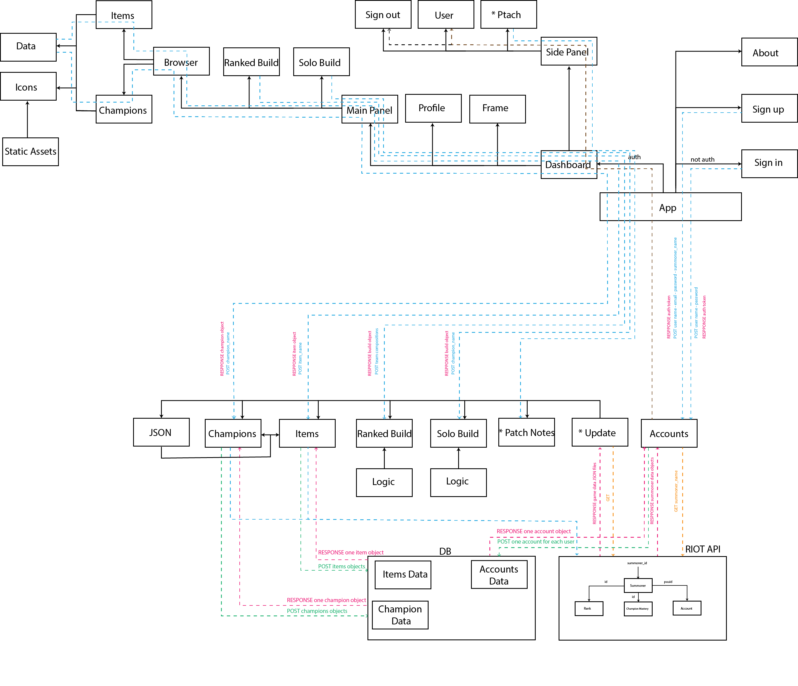
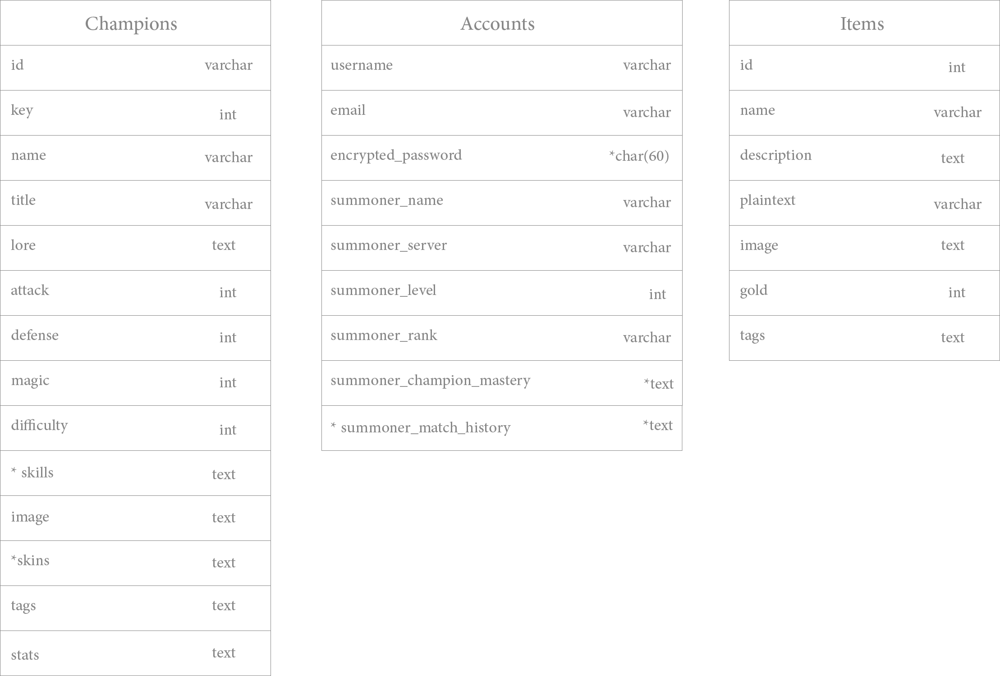

# League Advisor App

### We are deployed on *GitHub*

[League Advisor App](https://github.com/League-Advisor/league-advisor-app)

---

## Web App

### *TBA*

---

## Features and Tests

### *TBA*

---

## User Stories

[User Stories](https://github.com/orgs/League-Advisor/projects/2)

---

## Wireframes

---

## Domain Model

- Items marked with * are stretch goals or may require different approach.

---
## Database Schema Diagram

- Items marked with * are stretch goals or may require different approach.

---

## Project Directory Tree

### *TBA*

---

## Tools Used

[GitHub Projects - League Advisor Web App](https://github.com/orgs/League-Advisor/projects/2)

- yarn
- next 
- react
- javascript
- tailwind

- axios

---

## Getting Started

### *TBA*

---

## Change Log

v0.1: _feat: started project and created project repo_ - 08 Dec 2021

v0.1.1 _docs: added requirements, domain model and db schema_ - 08 Dec 2021

v0.1.2 _docs: edited domain model and db schema_ - 09 Dec 2021

v0.2.1 _feat: created login component and added icons assets_ - 12 Dec 2021

v0.2.2 _fix: added to login component_ - 12 Dec 2021

v0.2.4 _feat:added webm background to login page and included assets_ - 13 Dec 2021

v0.2.3: _feat: added sign up componenet_ - 12 Dec 2021 

v0.2.4 _feat:added image bg to login page_ - 13 Dec 2021

v0.2.3 _feat:added image bg to login page_ - 13 Dec 2021

v0.2.5 _feat:added webm background to login page and included assets_ - 13 Dec 2021

v0.2.6 _feat:added solo and ranked component_ - 13 Dec 2021

v0.2.7 _feat: fix solo build component_ - 14 Dec 2021

v0.2.3: _feat: added sign up componenet_ - 12 Dec 2021 

v0.2.4 _feat:added webm background to login page and included assets_ - 13 Dec 2021

v0.2.5 _feat:created profile skeleton_ - 13 Dec 2021

v0.2.6 _feat:added image bg to login page_ - 13 Dec 2021

v0.2.7 _feat:added solo and ranked component_ - 13 Dec 2021

v0.2.8 _refactore:added solo and ranked component_ - 14 Dec 2021

v0.3.0 _feat:update dashboard page and connect it with other pages , did some css_ - 13 Dec 2021

v0.4.0 _feat: compleated championbrowse and itembrowse componnent_ 12 Dec 2021

v0.4.1 _feat:added css to profile component_ - 14 Dec 2021

v0.4.2 _feat:handeled Signup component functionality_ - 14 Dec 2021

v0.4.3 _feat:edit css for apps_ - 14 Dec 2021

v0.4.4 _feat:edit css for dashboard ,champions and items_ - 14 Dec 2021

v0.4.5 _feat:patch notes component_ - 14 Dec 2021

v0.4.6 _feat: handled SoloItem component render_ 14 Dec 2021

---

## Test Coverage

### *TBA*

---

## Authors

- Bashar Taamneh
- Du'a Jaradat
- Ehab Ahmad
- Mohammed Al-Hanbali
